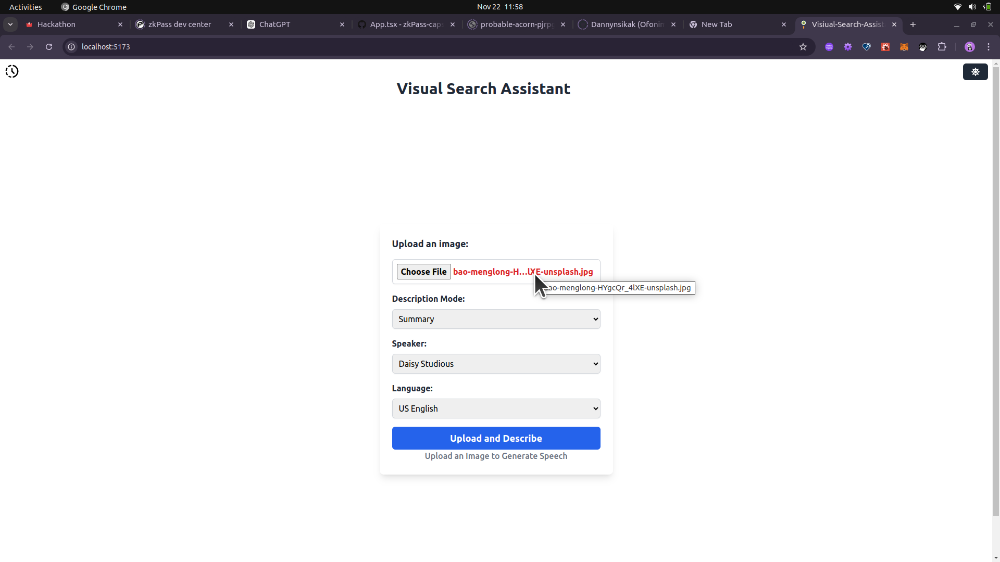
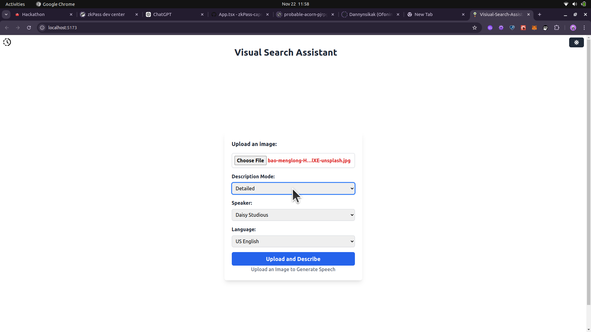
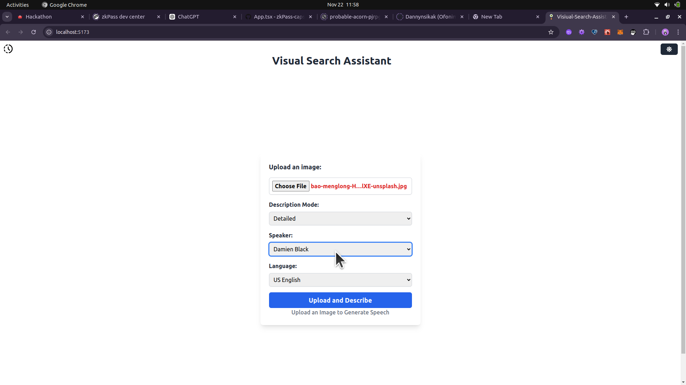
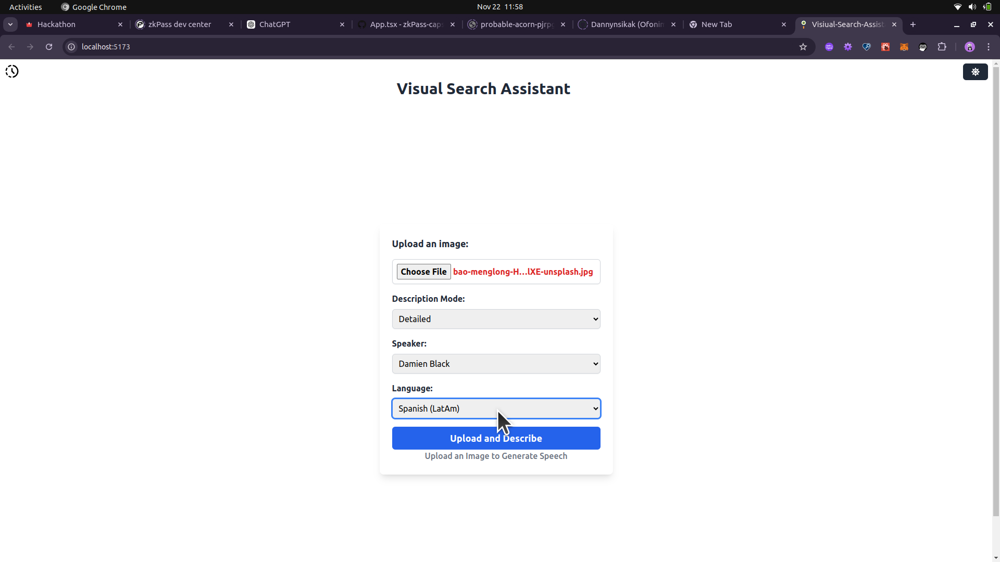
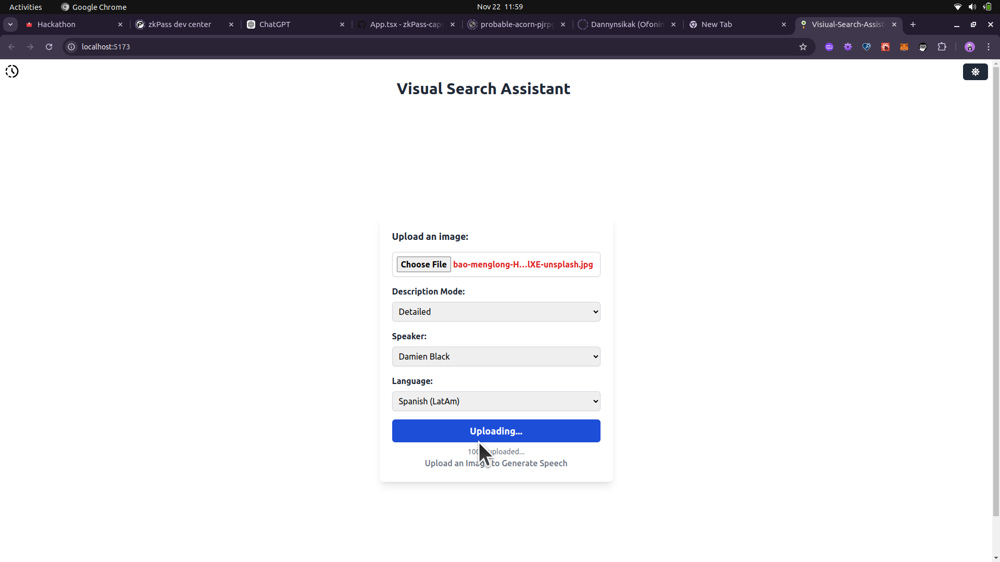
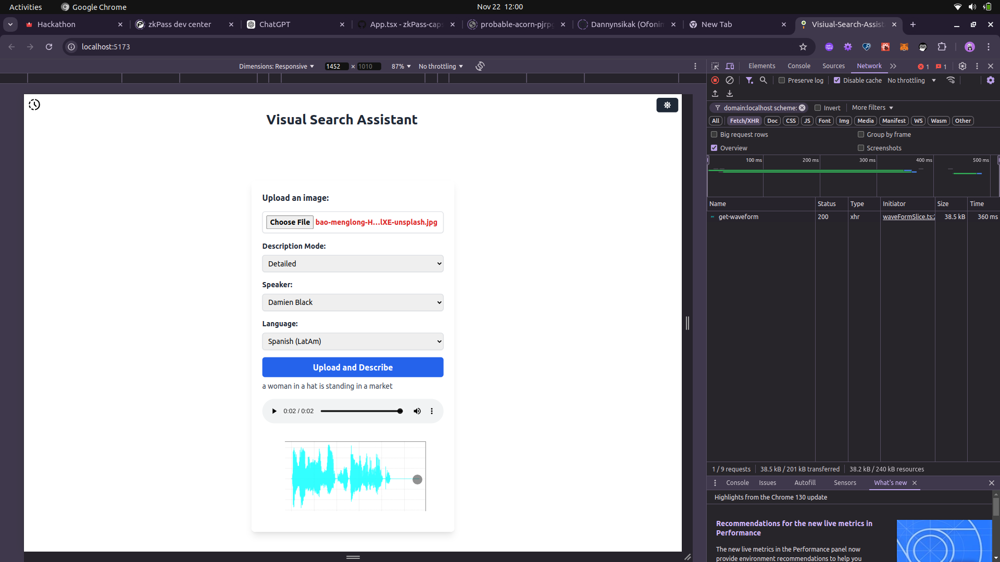

## Visual Search Assistant

The Visual Search Assistant is a powerful tool designed to enhance accessibility for visually impaired users. By uploading images, users can receive descriptive text and audio outputs, leveraging advanced machine learning technologies to provide summary and detailed modes for image descriptions.

## Table of Contents

Features

Technologies Used

Setup Instructions

Usage

Project Structure

API Endpoints

Future Improvements

License

## Features

# Image Upload and Processing

File Upload: Users can upload image files in various formats (JPEG, PNG).
File Validation: Ensures that only valid image files are processed.
Progress Feedback: Shows a progress bar while uploading the image.

# Image Description Generation

Dynamic Description Modes: Supports two modes for description:
Summary Mode: A brief overview of the image.
Detailed Mode: A more comprehensive description of the image content.
Description Text Output: Displays the generated text description for user reference.

# Audio Generation

Speech Synthesis: Utilizes Coqui TTS to convert descriptions into high-quality audio files (WAV).
Audio Playback: Provides a built-in audio player to play the generated description audio.
File Managements: Generates Dynamic path linking to server-stored audio files.
**Multilingual Support**: Generate image descriptions and convert them into audio in multiple languages supported by **Coqui TTS**, enhancing accessibility for users worldwide.

# Error Handling

Invalid File Detection: Detects non-image files and prompts users to upload valid formats.
Playback Error Handling: Catches errors that occur during audio playback and provides feedback.

# Storage and Database Interaction

Database Logging: Stores generated descriptions in the database for future retrieval.
Unique File Paths: Organizes uploaded files and audio files with unique identifiers for easy management.

# Responsive and Accessible UI

Frontend Framework: Built with React and Tailwind CSS, providing a responsive and visually appealing UI.
Accessibility: Designed to be user-friendly for all users, with a focus on accessible elements for audio playback.

# WAV Image Visualization for Audio Paths

Added a new feature to enhance the accessibility and interactivity of the platform! Now, not only does the Visual Search Assistant generate text descriptions and audio files, but it also provides a visual representation of the generated audio.

How it works:
Audio Path Visualization: After processing an image and generating the description audio, the backend now creates a visual waveform image (wav.png) of the audio file, which is displayed to the user in the frontend.

Waveform Display: This new visual feature helps users better understand the structure of the audio, providing a graphical representation of sound waves. It offers users an additional layer of feedback, showing the peaks and valleys of the audio's intensity.

Why it's useful: This feature enhances the user experience by providing both auditory and visual outputs. It's particularly beneficial for users who prefer a more interactive and engaging interface, or for visually impaired users who may benefit from additional context around the audio content.

## Technologies Used

# Frontend:

React: JavaScript framework for building the UI.
Tailwind CSS: Utility-first CSS framework for fast, responsive design.
Axios: Used for handling HTTP requests to the backend server.
Redux & ReduxToolkit: used for state mangement of the entire App.

# Backend:

Python with FastAPI: High-performance Python framework for building API endpoints.
Transformers Library: Uses the VisionEncoderDecoderModel for image-to-text processing.
Coqui TTS: Provides text-to-speech functionality, replacing Pydub python module.
Pillow: Image processing library for loading and validating images.
Torch: Supports running deep learning models.

# Machine Learning:

VisionEncoderDecoderModel: A pre-trained model that generates decriptive text from images.

ViTImageProcessor and AutoTokenizer: Tools for pre-processing images and tokenizing text to make them compatible with the model.

Chromadb:ChromaDB is a vector database used to store and manage metadata of generated descriptions. It enables efficient retrieval and search functionality by representing data as embeddings, making it ideal for handling complex queries, such as searching for similar image descriptions or categorizing data based on content relationships.

Coqui TTS: Coqui TTS is an open-source, user-friendly text-to-speech (TTS) library designed to convert written text into natural-sounding speech. It supports multilingual voices, fine-tuning, and customization, making it ideal for applications like voice assistants, audiobooks, and accessibility tools.

# Database and Utilities

ChromaDB: Vector database for storing and managing metadata of generated descriptions.
UUID: Generates unique identifiers for files and data.

## Setup Instructions

Prerequisites
Node.js (for the frontend)
Python 3.7+ (for the backend)
Coqui TTS (for audio conversion)
VisionEncoderDecoderModel( A pre-trained model that generates decriptive text from images)
Chromadb (for database management)

## Steps to Set Up

Clone the repository:
git clone https://github.com/Dannynsikak/visual-search-assistant.git
cd visual-search-assistant

## Backend Setup:

Set up a virtual environment and install Python dependencies:

cd backend
python -m venv env
source env/bin/activate # On Windows, use `env\Scripts\activate`
pip install -r requirements.txt
use `pip check` to verify all installations

## Frontend Setup:

Install dependencies:

cd frontend
npm install

## Run the Application:

Start the backend server:
cd backend
uvicorn main:app --reload

Start the frontend development server:
cd frontend
npm run dev

## Usage

Upload Image: Navigate to the upload section and select an image.
Choose Mode: Pick either “Summary” or “Detailed” for the description and for the speaker and language select the needed speaker and language from the list of options.
Submit for Processing: Click "Upload and Describe" to start processing.

View Results:
Text Output: Read the generated output.
Audio Playback: Use the built-in player to listen to the description.
audio_waveform_image: generated visual waveform image

## Project Structure

# graphql

`visual-search-assistant/
├── backend/
│ ├── app.py # Main FastAPI server file
│ ├── image_processing.py # Image upload and processing logic & also process the speech from the description
│ └── chromadb_config.py #  # Machine learning models
├── frontend/
│ ├── public/
│ │ │ ├── README.mdImgs # stores the static photos and videos
│ ├── src/
│ │ ├── components/
│ │ │ ├── SearchComponent.tsx # Main upload component
│ │ │ ├── LatestRecordingsComponent.tsx # fetches  the latest recording fromt the backend server
│ │ │ ├── ToggleBtn.tsx # handles the screen toggle from dark to light
│ │ │ ├── ToggleModel.tsx # Toggle component
│ │ └── slices/
│ │ └── latestRecordings.ts # slice to handle the latestRecordings
│ │ └── searchSlice.ts # slice to handle the imageUploads
│ └── App.tsx
│ └── index.css
│ └── main.tsx
│ └── store.ts
└── README.md`

## API Endpoints

POST /upload-image
Description: Accepts an image file, processes it, and returns description and audio paths.
Parameters:
file (required): Image file to process.
description_mode (optional): "summary" or "detailed".
speaker: select from the list of available speakers
language: select from the list of available languages
Response:
description: Generated text description.
audio_paths: URL to generated audio file.
audio_waveform_image: URL to the generated visual waveform image (wav.png) representing the audio file.
Get /latest-recordings
Descrription: Returns the available six generated speech

# Future Improvements

Image Caching: Add caching for previously processed images to improve performance.
Additional Modes: Include additional modes, such as “creative” or “contextual.”
Expanded Language Options: Leverage Coqui TTS's multilingual capabilities to allow users to choose their preferred language for text descriptions and audio outputs.
Extended Error Logging: Implement more robust logging for better debugging.

# Video Demonstration

<video controls src="./frontend/public/README.mdImgs/Project2.mp4" title="Visual Search Assitant"></video>

# Waveform Image generation Demonstration

<video controls src="./frontend/public/README.mdImgs/waveformImage.mp4" title="WaveForm Visualization"></video>

# License

This project is licensed under the MIT License. See the LICENSE file for more information.
